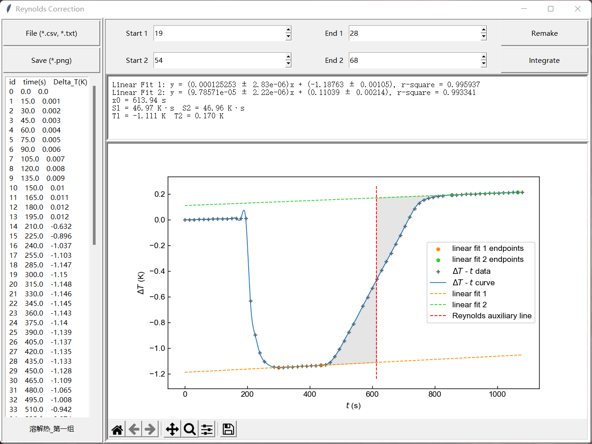

# Reynolds Correction

Author: ZhaoZh02

Email: zzh@stu.pku.edu.cn

用于积分雷诺校正，可以方便地拟合直线、给出拟合误差、寻找使积分面积相等的点，并求出校正后的温度。

> 拯救~~物化实验~~
>
> ——即使它没了
>
> 2022.11.22

---

## 使用说明

0. 运行python程序，生成图形界面，需安装 `numpy`和 `scipy`库。
1. 点击**File**导入文件。
2. csv或txt文件格式：两列纯数据，第一列为**升序**的time(s)，第二列Delta_T(K)；同一行数据间以**半角逗号**分隔。
3. 调整**Start 1 < End 1 < Start 2 < End 2**至合适位置，推荐单击输入栏后使用键盘↑↓进行调节，报错可以**Remake**。
4. 点击**Integrate**积分。
5. 点击**Save**按钮保存png格式图片，与数据文件位于同一目录。也可使用下方matplotlib控件，若显示不全请调整窗口大小。

## main.py中可修改的参数

1. 图片坐标轴和刻度，位于 `# set spines and ticks` (line 46)
2. 图片点、线、积分面积等，位于函数 `def dynamic_plot` (line 517)、`def Reynolds_plot` (line 543)。
3. 积分步长，位于 `def Reynolds` (line 465)，默认值 `dx = 0.005`，`dx`过小将使积分时间过长。

> 寻找积分面积相等的点本来可以写二分法的，但不改也不耽误用所以就懒了。以及，写GUI别用Tkinter！

---

## License

MIT License
